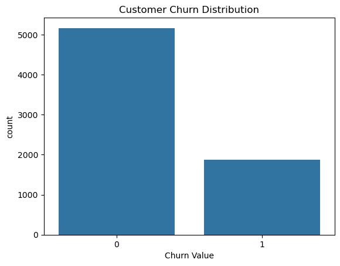
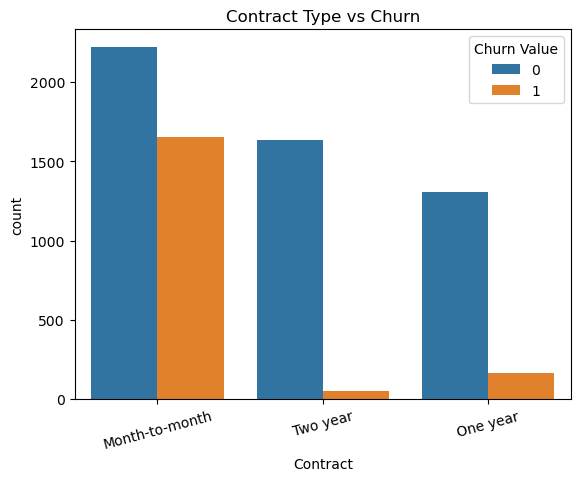
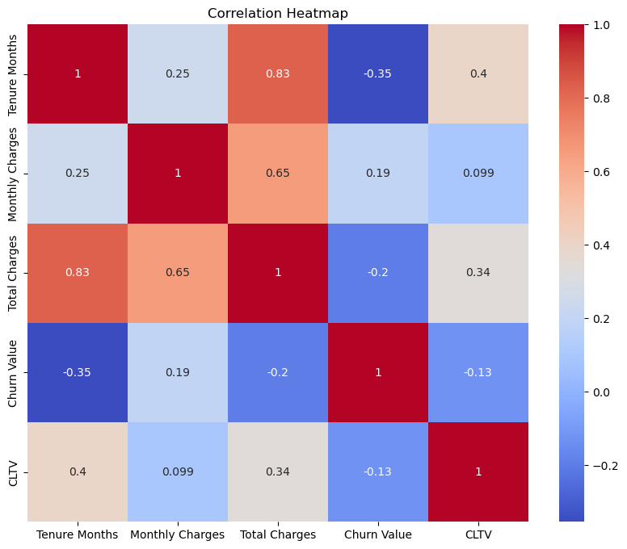
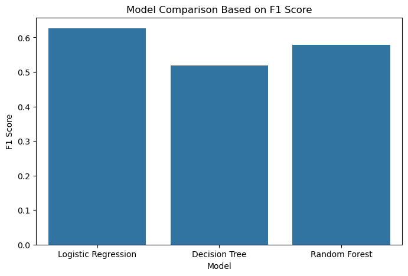
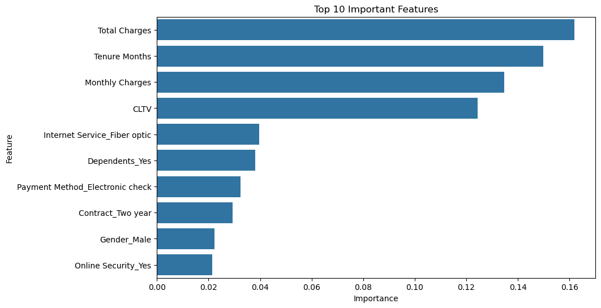

# 📊 Customer Churn Analysis & Prediction

## Project Overview

Customer churn is one of the most critical challenges faced by subscription-based businesses. Retaining existing customers is often more cost-effective than acquiring new ones.

This project analyzes customer behavior and develops a machine learning pipeline to predict whether a telecom customer is likely to churn based on demographic information, account details, and service usage patterns.

The project follows a complete end-to-end machine learning workflow, including data cleaning, exploratory data analysis, feature engineering, model training, evaluation, and business insight generation.

---

## 🎯 Objective

The primary objectives of this project are:

* Identify factors influencing customer churn.
* Perform exploratory data analysis to uncover business insights.
* Build machine learning classification models to predict customer churn.
* Compare model performance using multiple evaluation metrics.
* Identify the most important factors contributing to customer churn.

---

## 📂 Dataset Information

**Dataset:** Telco Customer Churn Dataset

### Features Include

* Customer Demographics
* Account Information
* Subscription Details
* Internet Services
* Contract Type
* Payment Methods
* Monthly Charges
* Total Charges
* Customer Lifetime Value (CLTV)

### Target Variable

| Variable    | Description                                 |
| ----------- | ------------------------------------------- |
| Churn Value | 0 = Customer Retained, 1 = Customer Churned |

---

## 🛠️ Tech Stack

### Programming Language

* Python

### Data Analysis

* Pandas
* NumPy

### Data Visualization

* Matplotlib
* Seaborn

### Machine Learning

* Scikit-Learn

### Development Tools

* Jupyter Notebook
* VS Code
* Git
* GitHub

---

## 📋 Project Workflow

### 1. Data Cleaning

* Handled missing values
* Removed duplicate records
* Converted incorrect data types
* Removed data leakage columns

### 2. Exploratory Data Analysis (EDA)

* Customer churn distribution analysis
* Tenure analysis
* Monthly charges analysis
* Contract type analysis
* Internet service analysis
* Payment method analysis
* Correlation analysis

### 3. Feature Engineering

* One-Hot Encoding
* Feature Selection
* Train-Test Split
* Feature Scaling using StandardScaler

### 4. Model Training

* Logistic Regression
* Decision Tree Classifier
* Random Forest Classifier

### 5. Model Evaluation

* Accuracy
* Precision
* Recall
* F1 Score
* ROC-AUC Score

### 6. Model Comparison

* Compared multiple classification models
* Selected the best-performing model

### 7. Model Saving

* Saved the final trained model using Joblib

---

## 🚀 Project Status

| Phase                       | Status      |
| --------------------------- | ----------- |
| Data Cleaning               | ✅ Completed |
| Exploratory Data Analysis   | ✅ Completed |
| Feature Engineering         | ✅ Completed |
| Data Preprocessing          | ✅ Completed |
| Model Training              | ✅ Completed |
| Model Evaluation            | ✅ Completed |
| Model Comparison            | ✅ Completed |
| Feature Importance Analysis | ✅ Completed |
| Model Saving                | ✅ Completed |

---

## 🤖 Models Evaluated

| Model               | Accuracy | Precision | Recall | F1 Score |
| ------------------- | -------: | --------: | -----: | -------: |
| Logistic Regression |    0.807 |     0.647 |  0.607 |    0.626 |
| Decision Tree       |    0.743 |     0.517 |  0.521 |    0.519 |
| Random Forest       |    0.796 |     0.642 |  0.527 |    0.579 |

---

## 🏆 Best Performing Model

### Logistic Regression

The Logistic Regression model achieved the best overall performance on the test dataset.

### Performance Metrics

* Accuracy: 80.74%
* Precision: 64.67%
* Recall: 60.70%
* F1 Score: 62.62%

The trained model has been saved and can be reused for future churn predictions.

---

## 📈 Key Business Insights

* Customers with shorter tenure are significantly more likely to churn.
* Month-to-month contracts experience the highest churn rates.
* Higher monthly charges are associated with increased churn risk.
* Customers with higher total charges tend to remain loyal.
* Customers with higher CLTV are less likely to churn.
* Fiber optic internet users show higher churn tendencies.
* Electronic check users are more likely to churn.
* Long-term contracts improve customer retention.
* Customers using online security services tend to remain subscribed longer.

---

## 🔍 Top Features Influencing Customer Churn

| Rank | Feature                           |
| ---- | --------------------------------- |
| 1    | Total Charges                     |
| 2    | Tenure Months                     |
| 3    | Monthly Charges                   |
| 4    | CLTV                              |
| 5    | Internet Service (Fiber Optic)    |
| 6    | Dependents                        |
| 7    | Payment Method (Electronic Check) |
| 8    | Contract (Two Year)               |
| 9    | Gender                            |
| 10   | Online Security                   |

---

## 📊 Project Visualizations

### Customer Churn Distribution



### Contract Type vs Churn



### Correlation Heatmap



### Model Comparison



### Feature Importance



---

## 📁 Project Structure

```text
Customer_Churn_Analysis/
│
├── data/
│   ├── raw/
│   └── processed/
│
├── notebooks/
│   ├── 01_Data_Cleaning.ipynb
│   ├── 02_EDA.ipynb
│   ├── 03_Feature_Engineering.ipynb
│   └── 04_Model_Training.ipynb
│
├── images/
│
├── models/
│   └── customer_churn_model.pkl
│
├── reports/
├── outputs/
│
├── requirements.txt
└── README.md
```

---

## 🎓 Skills Demonstrated

* Data Cleaning
* Exploratory Data Analysis
* Data Visualization
* Feature Engineering
* One-Hot Encoding
* Feature Scaling
* Classification Modeling
* Model Evaluation
* Model Comparison
* Feature Importance Analysis
* Business Insight Generation
* Model Deployment Preparation

---

## 📬 Author

**Harsh Poonia**

🎓 MCA Student | Machine Learning & Data Analytics Enthusiast

GitHub: https://github.com/Harshpoonia

---

⭐ If you found this project useful, feel free to explore the repository and connect with me.
